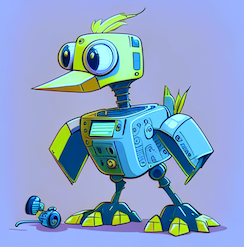

|||
|---|---|
|  | <h1>RoboDuck</h1> [](https://hdmamin.github.io/roboduck/) [](https://badge.fury.io/py/roboduck) [](https://github.com/hdmamin/roboduck/actions/workflows/main.yml) |


*rubber duck debugging*: a method of debugging code by articulating a problem in spoken or written natural language. The name is a reference to a story in the book The Pragmatic Programmer in which a programmer would carry around a rubber duck and debug their code by forcing themselves to explain it, line-by-line, to the duck. [[1](https://en.wikipedia.org/wiki/Rubber_duck_debugging)]

*robo duck debugging*: like rubber duck debugging, but the duck talks back.

## About

Copilot takes your programs from 0 to 50; RoboDuck is designed to get you from 90 to 100. It essentially embeds an LLM (large language model) in the Python interpreter, providing drop-in natural language replacements for Python's standard approaches to:
- debugging  
- error handling  
- logging  

## Quickstart

# TODO add gifs

### API Key Setup

You need an openai API key to begin using roboduck. Once you have an account ([sign up here](https://platform.openai.com/signup)), you can visit https://platform.openai.com/account/api-keys to retrieve your key. Your simplest option is to call `roboduck.set_openai_api_key(api_key, update_config=True)` which essentially does the following: 

```bash
mkdir ~/.roboduck
echo "openai_api_key: your_api_key_here" > ~/.roboduck/config.yaml
```

Alternatively, you can also set `os.environ['OPENAI_API_KEY'] = api_key`.

Roboduck does not store your API key or collect any usage data.

### Debugger

We provide a natural language equivalent of python's built-in `breakpoint` function. Once you're in an interactive session, you can use the standard pdb commands to navigate your code (cmd+f "debugger commands" [here](https://docs.python.org/3/library/pdb.html). TLDR: type `n` to execute the next line, a variable name to view its current value, or `q` to quit the debugging session). However, you can also type a question like "Why do we get an index error when j changes from 3 to 4?" or "Why does nums have three 9s in it when the input list only had one?". Concretely, any time you type something including a question mark, an LLM will try to answer. This is not just performing static analysis - the LLM can access information about the current state of your program.

```
from roboduck import duck

def bubble_sort(nums):
    for i in range(len(nums)):
        for j in range(len(nums)):
            if nums[j] > nums[j + 1]:
                nums[j + 1] = nums[j]
                nums[j] = nums[j + 1]
                duck()   # <--------------------------- instead of breakpoint()
    return nums

nums = [3, 1, 9, 2, 1]
bubble_sort(nums)
```

### Errors

Roboduck is also good at explaining error messages.  Importing the errors module automatically enables *optional* error explanations. `errors.disable()` reverts to python's regular behavior on errors. `errors.enable()` can be used to re-enable error explanations or to change settings. For example, setting auto=True automatically explains all errors rather than asking the user if they want an explanation (y/n) when an error occurs (this is probably excessive for most use cases, but you're free to do it).

```
from roboduck import errors

data = {'x': 0}
y = data.x

errors.disable()
y = data.x

errors.enable(auto=True)
y = data.x
```

### Jupyter Magic

Jupyter provides a `%debug` magic that can be used after an error occurs to enter a postmortem debugging session. Roboduck's `%duck` magic works similarly, but with all of our debugging module's conversational capabilities:

```
# cell 1
from roboduck import magic

nums = [1, 2, 3]
nums.add(4)
```

```
# cell 2
%duck
```

### Logging

Roboduck also provides a logger that can write to stdout and/or a file. Whenever you log an Exception object, an LLM will try to diagnose and suggest a fix for the problem. (Unlike the debug module, the logger does not type responses live because we assume logs will typically be viewed after the fact.)

```
from roboduck import logging

logger = logging.getLogger(path='/tmp/log.txt')
data = {'x': 0}
try:
    x = data.x
except Exception as e:
    logger.error(e)
```

### CLI

You can also run a python script with error explanations enabled:

```bash
duck my_script.py
```

Run `duck --help` for more info.

## Contributing

To create a virtual environment and install relevant packages:
```
make dev_env
```

To run unit tests:
```
make test
```

To rebuild the docs locally:
```
make docs
```

### Repo Structure
```
roboduck/
├── lib          # Python package source code
├── bin          # Executable scripts to be run from the project root directory.
├── docs         # Markdown templates that mkdocs uses to build automatic documentation.
├── site         # The autogenerated content that makes up our documentation, deployed with github pages.
├── .github      # Build that executes when pushing or merging to main.
├── tests        # Pytest unit tests.
└── data         # Contains images for our README. Used locally to store other miscellaneous files that are excluded from github.
```
